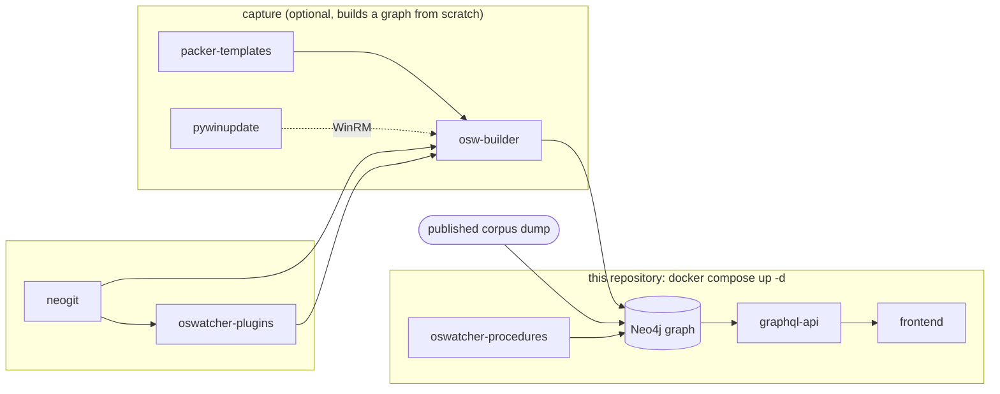

# OSWatcher

[](LICENSE)
[](https://github.com/OSWatcher/oswatcher/stargazers)

> 70 installed OS releases, from Windows 95 to Windows 11 25H2 and Ubuntu 6.10 to 25.04,
> captured and diffable in one graph. One command to run it locally.

OSWatcher installs historical OS releases in VMs, captures the installed filesystem, registry and
debug symbols offline, and stores every state as a content-addressed Merkle graph in Neo4j. Think
git for golden images, but the object graph lives in a database, so you can query history in any
direction: which build first shipped a file, or every build that ever contained it.

## Why this exists

OSWatcher started in 2016 as a personal experiment: index every OS release I could get my hands
on, and capture its installed state at a fine enough grain that every file, registry key and
kernel symbol could be tracked and queried across releases. Git was the first backend, and it
turned out to be the wrong one: it records snapshots well, but it can't answer questions that
cut across hundreds of them. So the object graph moved into a graph database.

The questions it was built for are set questions over OS history, not diffs between two builds:

- On which releases does this registry key appear? This `_EPROCESS` field?
- Which `System32` files, or which kernel symbols, stay unchanged across a large span of Windows
  releases, and which are always moving?
- Which releases share this exact file, and where does its history fork?

Diffing two recent builds is well served today ([Winbindex](https://winbindex.m417z.com),
[windiff](https://github.com/ergrelet/windiff), [Vergilius](https://www.vergiliusproject.com)),
and LLM-assisted tooling has made patch diffing and reverse engineering far cheaper than when
this project started. What OSWatcher still has is the captured data itself, including old builds
that are hard to reproduce now (the Windows Update servers for 2000, XP and Vista shut down in
2019, and many old ISOs no longer have an official download).

What the public corpus holds:

| Layer | Coverage |
|-------|----------|
| Filesystem (every path and SHA-1, per build) | 33 Windows builds, 39 Ubuntu releases |
| Update chains | KB-level states on most Windows 10/11 branches (e.g. 22H2 from 7 RTM through 2026 CUs) |
| Kernel symbols and struct layouts | PDB for Windows (`ntoskrnl.exe` and others), DWARF for Ubuntu kernels |
| Registry | Key hierarchy, value names, types and hashes: you see *that* a value changed, not its content (values are redacted in the public dump) |

Not in it (yet): file contents (hashes only; Windows PE binaries resolve through Winbindex for
2016 and later), releases after Windows 11 25H2 and Ubuntu 25.04, syscall tables. If one of
those gaps is what stops you from using it, [open an issue](https://github.com/OSWatcher/oswatcher/issues)
and say so.

## Quickstart

```bash
git clone https://github.com/OSWatcher/oswatcher
cd oswatcher
docker compose up -d
```

There's nothing to configure: no passwords, no domain. On the first start the stack downloads
the corpus (a Neo4j dump, ~2.4 GB) and loads it before the database comes up. This happens once;
later starts are instant.

| Service | URL |
|---------|-----|
| Web UI (browse a branch, pick two commits, compare) | <http://localhost> |
| Neo4j browser (Cypher, no login) | <http://localhost:7474> |
| GraphQL API | <http://localhost:4000/graphql> |
| MinIO console | <http://localhost:9001> |

Stop it with `docker compose down`. **Never run `docker compose down -v`**: that deletes the
volumes holding the database.

## Try these first

Paste into the Neo4j browser at <http://localhost:7474>.

**Where does `_EPROCESS.Token` sit, on every build?**

```cypher
MATCH (b:Branch)-[:TRACKS_COMMIT]->(:Commit)-[:OWNS_FILESYSTEM]->(root:Tree),
      (root)-[w:HAS_CHILD_TREE]->()-[s:HAS_CHILD_TREE]->()-[k:HAS_CHILD_BLOB]->(nt:Blob),
      (nt)-[:HAS_STRUCT {name: '_EPROCESS'}]->(:Struct)-[hf:HAS_FIELD {name: 'Token'}]->(f)
WHERE toLower(w.name) = 'windows' AND toLower(s.name) = 'system32'
  AND toLower(k.name) = 'ntoskrnl.exe' AND b.name <> 'windows'
RETURN f.offset AS offset, collect(b.name) AS builds
ORDER BY offset
```

| Offset | Builds |
|--------|--------|
| `0xC8` | XP SP3 (x86) |
| `0x208` | 7 RTM |
| `0x348` | 8 |
| `0x358` | 10 1507 to 1809 |
| `0x360` | 10 1903, 1909 |
| `0x4B8` | 10 2004 to 11 23H2 |
| `0x248` | 11 24H2, 25H2 |

Change `Token` to any field (`Protection`, `MitigationFlags`, `ActiveProcessLinks`) or
`_EPROCESS` to any other struct.

**Which `_EPROCESS` fields exist in every captured build, XP SP3 to Windows 11 25H2?**

```cypher
MATCH (b:Branch)-[:TRACKS_COMMIT]->(:Commit)-[:OWNS_FILESYSTEM]->(root:Tree),
      (root)-[w:HAS_CHILD_TREE]->()-[s:HAS_CHILD_TREE]->()-[k:HAS_CHILD_BLOB]->(nt:Blob),
      (nt)-[:HAS_STRUCT {name: '_EPROCESS'}]->(:Struct)-[hf:HAS_FIELD]->()
WHERE toLower(w.name) = 'windows' AND toLower(s.name) = 'system32'
  AND toLower(k.name) = 'ntoskrnl.exe' AND b.name <> 'windows'
WITH hf.name AS field, count(DISTINCT b) AS n
WITH collect({field: field, n: n}) AS rows, max(n) AS total
UNWIND rows AS r
WITH r, total WHERE r.n = total
RETURN total AS builds, collect(r.field) AS fields_in_every_build
```

72 fields, out of the 107 to 263 the struct has depending on the build. Drop the `WHERE r.n = total`
filter to see the fields that come and go.

**What changed between two builds:** open the web UI, pick a branch, select two commits and
compare. A whole Windows 11 filesystem diff (24H2 to 25H2, ~100,000 changed entries) runs in
under ten seconds.

The graph schema is small: `(Branch)-[:TRACKS_COMMIT]->(Commit)-[:OWNS_FILESYSTEM]->(Tree)`, then
`HAS_CHILD_TREE` / `HAS_CHILD_BLOB` down to files, and `HAS_STRUCT`, `HAS_SYMBOL`, `HAS_WINREG`
from a file to what was extracted from it. The next commit back is reached through `HAS_PREVIOUS`.

## Get involved

OSWatcher has been going since 2016 and is fully open source (Apache 2.0) as of 2026. The
most useful things right now:

- **Ask it something.** If you have a question about how Windows or Ubuntu changed over time,
  run it and tell us what you found, or [open an issue](https://github.com/OSWatcher/oswatcher/issues)
  with the question if the graph can't answer it yet. Findings made with OSWatcher get linked here.
- **Add a release.** Ubuntu releases are a few lines of YAML in
  [osw-builder](https://github.com/OSWatcher/osw-builder) (25.10 and 26.04 are open), and its
  [first-capture tutorial](https://oswatcher.github.io/osw-builder/tutorials/first-capture.html)
  goes from zero to a captured Ubuntu image without product keys.
- **Write a plugin.** Import tables, syscall tables, services, scheduled tasks: anything you can
  extract from a mounted disk image can be attached to the graph through
  [oswatcher-plugins](https://github.com/OSWatcher/oswatcher-plugins).

## How it fits together



This repository is the entry point and runs the stack. To build the corpus yourself from
installation media instead of downloading it, set `SEED_DB=false` in [`.env`](.env) before the
first `up -d` and follow [docs/building-a-corpus.md](docs/building-a-corpus.md).

<details>
<summary><b>All repositories</b></summary>

| Repository | What it is |
|------------|------------|
| [neogit](https://github.com/OSWatcher/neogit) | Git-like content-addressed filesystem snapshots, backed by Neo4j and pluggable object storage. The foundation everything builds on (`pipx install neogit`). |
| [oswatcher-plugins](https://github.com/OSWatcher/oswatcher-plugins) | Capture and analysis plugins that enrich the graph with symbols, parsed structs and registry data. |
| [oswatcher-procedures](https://github.com/OSWatcher/oswatcher-procedures) | User-defined Neo4j procedures, chiefly recursive tree diffing, shipped as a JAR. |
| [osw-builder](https://github.com/OSWatcher/osw-builder) | The capture pipeline: ISO to booted VM to captured graph, with optional update chains. |
| [packer-templates](https://github.com/OSWatcher/packer-templates) | Packer templates for the OS images osw-builder builds. |
| [pywinupdate](https://github.com/OSWatcher/pywinupdate) | Automated Windows Update installation over WinRM, used when building update chains. |
| [graphql-api](https://github.com/OSWatcher/graphql-api) | GraphQL API over the graph. |
| [frontend](https://github.com/OSWatcher/frontend) | Vue 3 web interface. |

Three archived datasets ([windows-desktop](https://github.com/OSWatcher/windows-desktop),
[ubuntu-server](https://github.com/OSWatcher/ubuntu-server),
[osw-fs-windows](https://github.com/OSWatcher/osw-fs-windows)) hold captures from the original
2016-2020 OSWatcher, which committed filesystems straight into git. They're frozen and not part
of the current toolchain. The original single-repo framework is preserved at the
[`v0-legacy`](https://github.com/OSWatcher/oswatcher/tree/v0-legacy) tag.

</details>

## Documentation

| Guide | Covers |
|-------|--------|
| [docs/architecture.md](docs/architecture.md) | How the pieces fit together |
| [docs/development.md](docs/development.md) | Running the API, frontend and procedures from source |
| [docs/building-a-corpus.md](docs/building-a-corpus.md) | Filling the graph with osw-builder |
| [docs/deployment.md](docs/deployment.md) | Running on a server: domain, TLS, backups, rollback |

Issues and questions go here for anything cross-cutting, or on the specific repository for
anything scoped to it. See [CONTRIBUTING](https://github.com/OSWatcher/.github/blob/main/CONTRIBUTING.md);
for vulnerability reports, [SECURITY](https://github.com/OSWatcher/.github/blob/main/SECURITY.md).

## License

[Apache 2.0](LICENSE)
